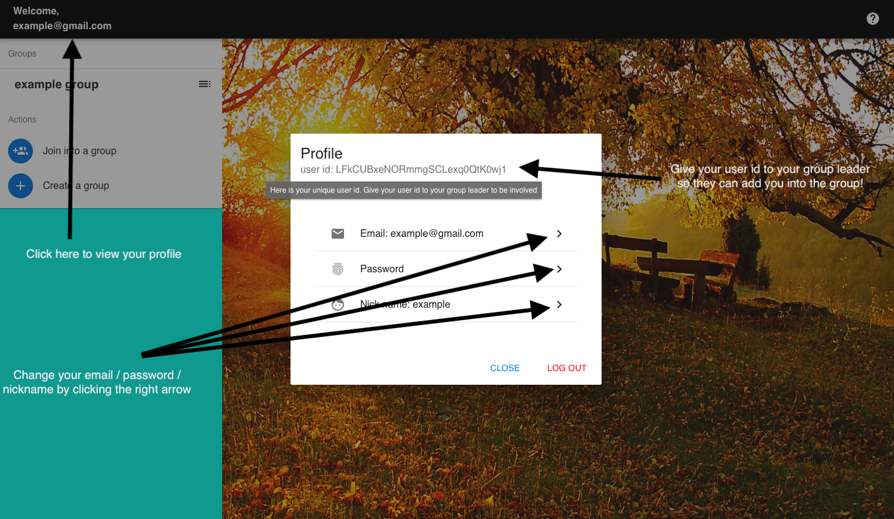

# Task-Publisher

> Task Publisher is a tool for working groups, help them divide the work more clearly and efficiently. Group Leader can create a group to include the group members and assign tasks to each members so everyone knows their job clearly.

## Build Setup

``` bash
# install dependencies
npm install

# serve with hot reload at localhost:8080
npm run dev

# start the project
npm start


For a detailed explanation on how things work, check out the [guide](http://vuejs-templates.github.io/webpack/) and [docs for vue-loader](http://vuejs.github.io/vue-loader).
```

## User Manual

### How to: view your profile

After your registeration, you can click your email shown at the left-top to view your profile.


