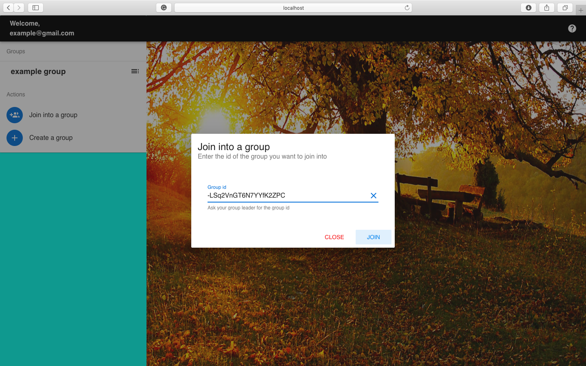

# Task-Publisher

> Task Publisher is a tool for working groups, help them divide the work more clearly and efficiently. Group Leader can create a group to include the group members and assign tasks to each members so everyone knows their job clearly.

## Build Setup

``` bash
# install dependencies
npm install

# serve with hot reload at localhost:8080
npm run dev

# start the project
npm start


For a detailed explanation on how things work, check out the [guide](http://vuejs-templates.github.io/webpack/) and [docs for vue-loader](http://vuejs.github.io/vue-loader).
```

## User Manual

### How to: view your profile

After your registeration, you can click your email shown at the left-top to view your profile.


### How to: Create and manage a group

As a group leader, you need to create a group to include your members


 : After create a group, you will see this button beside the group. Click this button to manage your group.


### How to: Add member / Join into a group

There are two ways to include a member into your group.

First one is give the group id to your member so he can join the group using the "join into a group". Group id could be found in the management page.


The other way is to use the "add member" button in the management page. In this way, you will need your member's user id.


As a member, you can either give your user id (which can be found in your profile page) to your leader and wait to be included, or you can use the "join into group" button and input the group id you got from the group owner



### How to: Change group name / group display name

As a leader, you can change the name of the group in the group management page


### How to: view your profile

As a member, you can change your display name in the group


### How to: Quit a group

 Press the  beside your display name in the group to quit.


 If you are the group owner, you will need to choose the new group owner.
 
 ### How to: Publish tasks

After you choose one member, his tasks will appear in the main frame. Press the  button under his name to add a task.


A task includes title, description, importance and deadline.

Also, a task could be edited (by the group owner or the member the task was assigned to), marked as finish and deleted.


### Header

 : This button will appear if you are the owner of the group. Click this button and cards under every member will show up.


Task publisher provides some functionalities to help users manage their tasks more efficiently.

  : user can sort their tasks by different orders: create time, importance, due date and assigned member.


  : Sort by anti order
 
   : Task Publisher provides a calendar view for user to check the deadline in a more direct way


   :  : The page will show the tasks that have been marked as finished after this button is pressed
 
 
